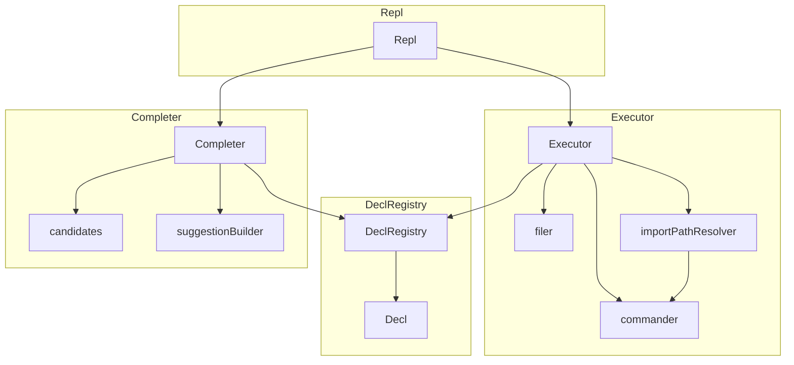
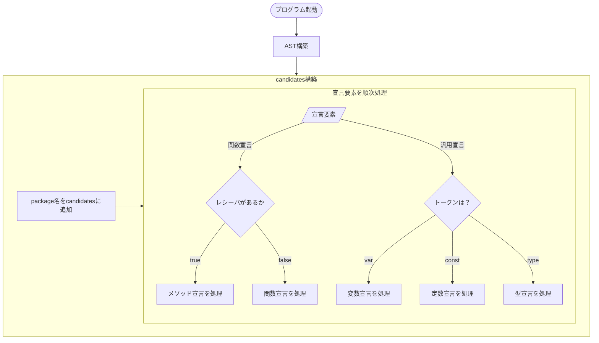
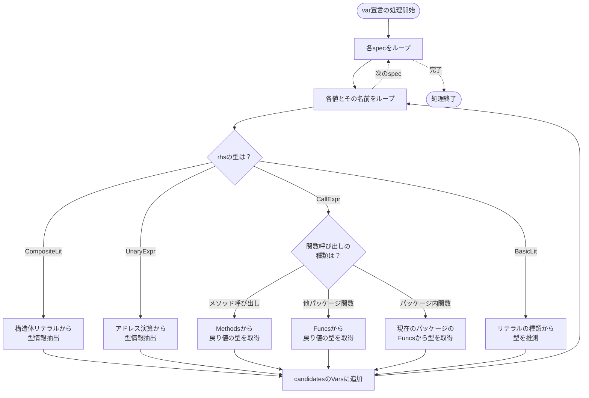
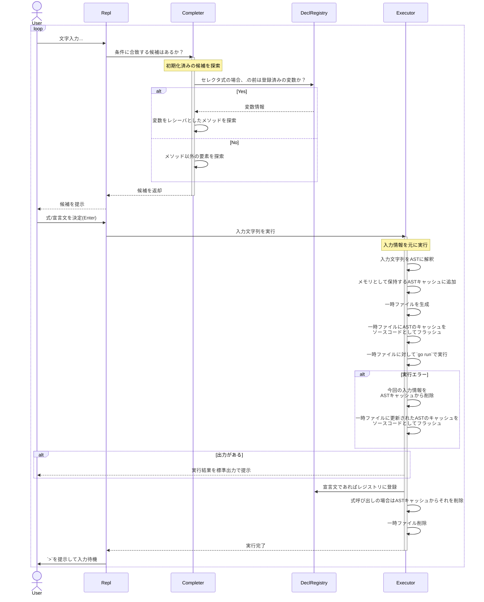

# はじめに

半年前に、「rails consoleのようにgolangを扱えるCLIを作った」という記事を書きました。

https://zenn.dev/yuta_kakiki/articles/5468fe79be932c

実はあれから数ヶ月の間は全く開発に着手せず、何も進展がありませんでした。

というのも、**コード/設計がカオスで手をつけたくなかった**からです。
当時はとりあえず動くものが見たいの一心でコードを書き殴っていました。期待の動作が実現できればいいマインドで進めてた感じです。

その結果、ちょっと開発から離れて戻ってきた時に全く自分でもわからないようなコードになっていたんです...。

そんなわけで新機能なんて追加できたもんじゃない、と半年間ほど放置していたのですが、最近重い腰を上げて**大規模なリファクタリング、設計の刷新**を行いました。

そのおかげで、（多分）機能追加もアーキテクチャ把握もしやすくなりました。
つまり、他人にも説明できるくらいには整備できたと思っています。

そこで、自身としての整理も含め、gonsoleがいかにしてgoのREPLを実現しようとしているのか、その設計と仕組みについて記事にしようと思った次第です。

「goを実行できるREPLは数多くは見かけない中、自分はこうやって実現しようとした」をお伝えしたいと思います。

# gonsoleで何ができるのか
改めて、gonsoleで何ができるのかを簡単に説明します。

Ruby on Railsを使ったことがある方なら一度は起動したことがある方も多いかと思いますが、`rails console`にインスパイアを受けて開発した、goコードを実行するREPLになります。

::::message
REPLとは、"Read–Eval–Print Loop"の略です。
- Read：入力を読む
- Eval：評価（実行）する
- Print：結果を表示する
- Loop：これを繰り返す

以下のような説明もある通り、いわゆる対話的コンソールですね。

> REPLにおいてユーザーが1つ以上の式を入力すると、インタプリタがそれを評価し結果をコンソールに表示する。
> 
> https://ja.wikipedia.org/wiki/REPL
::::

個人的なポイントは、
- 利用したいpackageのインポートの自動解決
- 補完の充実性

であり、手軽に実行できる点を重視しています。


では、実際に動かすとどういった感じかを簡単に説明していきます。

### 1. プロジェクトルートで起動する
ここでいうプロジェクトルートとは、`go.mod`ファイルがある場所を意味します。
`gonsole`とコマンドを打って起動すると以下のように表示されます。
```
gonsole
```


`>`に入力していきます。

::::message
以下のサンプルプロジェクトで起動している前提で進めていきます。
https://github.com/kakkky/gonsole-example
::::

### 2. 変数を定義する
サンプルプロジェクトに定義している`animal`パッケージの`NewDog()`コンストラクタでDogのインスタンスを格納した変数を定義してみましょう。

`:= `の直後で、まずパッケージの補完候補が羅列されていますね。


この時点では全パッケージ(標準パッケージ + プロジェクト内のパッケージ)の候補がでています。

これらはTabキーで選択できる上、入力を進めると絞り込まれます。
`a`でさらに絞り込まれました。


一番上の`animal`を選択したいので、Tabキーで移動してみましょう。


`animal`が補完されました。これで確定なので、`.`で続けます。


すると、`animal`パッケージの要素がまた羅列されます。同じ要領で進めます。


シグネチャに従って引数を入力し、


エンターを押します。


これで変数が定義できました。

### 3. メソッドを呼び出す
先ほど定義した`dog`変数は`Dog`型であり、`Dog`型にはいくつかメソッドが定義されています。
`dog.`と入力した時点で、メソッドの候補が出ます。


適当なメソッドを選んで実行します。この場合も同じく補完されます。


メソッドチェーンの補完にも対応します。
::::details サンプルプロジェクト内の定義
サンプルプロジェクトでは、以下のように定義されていました。`Feed()`が返す`Animal`はインターフェースです。`Dog`型はそのインターフェースを満たします。
つまり、構造体に紐づくメソッドだけではなくインターフェースである場合も適切に補完を返すようになっているんですね。
```go
// Feed feeds the dog and makes it full. Supports method chaining.
func (d *Dog) Feed() Animal {
	d.Fed = true
	return d // For method chaining
}

// GetStatus returns the dog's current status as a string.
// Status is determined based on feeding and exercise state.
func (d *Dog) GetStatus() string {
	// Short variable declaration
	status := "Energetic"
	if d.Fed && d.Tired {
		status = "Satisfied"
	} else if d.Fed {
		status = "Full"
	} else if d.Tired {
		status = "Tired"
	}
	return status
}
```
::::


### 3. 標準パッケージにもアクセスしてみる
適当に実行してみます。

http.Get()で`http://example.com`でも叩いてみます。


(長いので写真はちょっと切れてます。)


osパッケージやgoでサポートしてる円周率等も見てみたり。


::::message
現状、`runtime`パッケージはgonsoleが扱う対象から意図的に外していたのですが、あってもいいかもしれないなと書きながら思いました。
::::

構造体を返す時の出力がそもそもみづらい等々の色々改善点はありますが、現状こんな感じのことができますという説明でした。

# アーキテクチャ
gonsoleを構成しているコンポーネントについて整理します。
それぞれの役割と依存関係を整理した上で、次節にて「動作フロー」を追うことにします。

## 全体


## エントリーポイント
まずはエントリーポイントを見て見ましょう。大まかな依存関係は把握できるかと思います。
```go:cmd/gonsole/main.go
func main() {
	registry := declregistry.NewRegistry()
	executor, err := executor.NewExecutor(registry)
	if err != nil {
		errs.HandleError(err)
	}
	completer, err := completer.NewCompleter(registry)
	if err != nil {
		errs.HandleError(err)
	}
	repl := repl.NewRepl(completer, executor)
	if err := repl.Run(); err != nil {
		errs.HandleError(err)
	}
}
```
DeclRegistryインスタンスは、Completer & Executorに渡されています。
そして、Completer & ExecutorがReplインスタンスに渡され、Replを実行しています。

## Repl
入力待機・補完・実行、などREPLの基本的機能を取りまとめるコンポーネントになります。
https://github.com/kakkky/gonsole/blob/main/repl/repl.go

Replコンポーネントは、実際は別パッケージを利用した単純なラッパーです。
REPL実現手段として、`go-prompt`パッケージを選定しました。なお、今回の開発要件に適するように若干カスタムしたかったので、フォークしたものになります（どうカスタムしたかはCompleterの節にて）。
https://github.com/kakkky/go-prompt

他にも確か[readlineパッケージ](https://github.com/chzyer/readline?tab=readme-ov-file)等も候補として考えていましたが、`go-prompt`のUI/UXが自分好みだったのと、開発の際に使うメソッドのインターフェースが理想的だったことが採用に至った決め手だったと記憶します。

そんな`go-prompt`のインスタンスのコンストラクタは以下のようなインターフェースになっています。
```go
// New returns a Prompt with powerful auto-completion.
func New(executor Executor, completer Completer, opts ...Option) *Prompt {...}
```
入力時に発火する`Executor`, 補完候補を返す`Completer`の関数型が定義されています。コンストラクタにはその２つのコールバックを渡すという感じですね。
```go
// Executor is called when user input something text.
type Executor func(string)

// Completer should return the suggest item from Document.
type Completer func(Document) []Suggest
```

この実行ロジックと補完ロジックを柔軟かつシンプルに注入できる構造のおかげで、gonsole全体のアーキテクチャが決定しました。
実際には、以下のように`completer.Completer`構造体に紐づく`Complete()`と`executor.Executor`構造体に紐づく`Execute()`のメソッド値を渡すようにしています。
```go:repl/repl.go
// NewRepl はReplのインスタンスを生成する
func NewRepl(completer *completer.Completer, executor *executor.Executor) *Repl {
	pt := prompt.New(
		executor.Execute,
		completer.Complete,
		// 省略
	)
	return &Repl{
		pt: pt,
	}
}
```

## Completer
先述した通り、`go-prompt`に渡す補完ロジックを実装しているコンポーネントです。
```go
// Completer should return the suggest item from Document.
type Completer func(Document) []Suggest
```
Completerは、以下の２つの内部的なサブモジュールを利用して、補完ロジックを成り立たせます。
- candidates:
    - 候補のキャッシュを生成し保持
- suggestionBuilder: 
    - `go-prompt.Suggest`型を構築するビルダー

簡単にこれら２つに触れてから、補完ロジックを見ることにします。
### candidates（サブモジュール）
gonsoleは、起動されたプロジェクトルート配下の要素と標準パッケージの要素に対する実行をサポートするものなので、「候補」を返すにはその情報を持っておく必要があります。

candidatesは、gonsole起動時にプロジェクトルート配下のソースコードをparseし、「候補リスト」といった形で種類ごとに保持します。
```go:completer/candidates.go
type candidates struct {
	Pkgs       []types.PkgName
	Funcs      map[types.PkgName][]funcSet
	Methods    map[types.PkgName][]methodSet
	Vars       map[types.PkgName][]varSet
	Consts     map[types.PkgName][]constSet
	Structs    map[types.PkgName][]structSet
	Interfaces map[types.PkgName][]interfaceSet
}
```
::::details 種類それぞれの型定義
補完ロジックで必要な情報を持たせています。
```go
type (
	funcSet struct {
		Name        types.DeclName
		Description string
		Returns     []returnSet
	}
	methodSet struct {
		Name             types.DeclName
		Description      string
		ReceiverTypeName types.ReceiverTypeName
		Returns          []returnSet
	}
	varSet struct {
		Name        types.DeclName
		Description string
		TypeName    types.TypeName
		PkgName     types.PkgName
	}
	constSet struct {
		Name        types.DeclName
		Description string
	}
	structSet struct {
		Name        types.DeclName
		Fields      []types.StructFieldName 
		Description string
	}
	// interfaceの候補を返すわけではなく、関数がinterfaceを返す場合に、
	// そのinterfaceのメソッドを候補として返すためのもの
	interfaceSet struct {
		Name         types.DeclName
		Methods      []types.DeclName
		Descriptions []string
	}
)

type returnSet struct {
	TypeName types.TypeName
	PkgName  types.PkgName
}
```
::::

candidateの構築は泥臭くASTをコネコネしています。
ソースコードを`go/ast`パッケージを用いてparseしてAST表現に変えたものを、candidateの形にうまく収めています。雑に以下にフローチャートを書いてみました。

AST表現からどの種別の宣言かを割り出してからも、`swich-case`を駆使しまくってASTをこねます。
フローチャートの最後は`XXXを処理`と表現をぼかしていますが、ここでも結構色々分岐があり複雑です。

var宣言を処理する際を例として、以下に示してみました。

その変数の持つ型を確定させるために右辺（rhs）の形によって処理を分岐させたりする点が多少複雑になっています。まあ、そもそもトップレベルの変数宣言で関数orメソッドの戻り値を格納するのはあまりない気がしますが、対応できるようにしています。

::::message
１つのvar宣言についての処理で「各specをループ」と表していますが、これは例えば以下のような形を持つときに複数specを持つといえます。
```go
var (                    // ← GenDecl
    x = 1                // ← ValueSpec (spec1)
    y = "hello"          // ← ValueSpec (spec2)
    a, b = 3, 4          // ← ValueSpec (spec3, 複数名を持つ)
)
```
::::

変数宣言にもしっかり型を持たせたい意図としては、それによってメソッドの補完をしっかり効かせるようにするためです。

*http.DefaultClientを格納した変数にメソッドの補完が出る*


# 実行シーケンス



# 取らなかった技術的選択肢


# おわりに