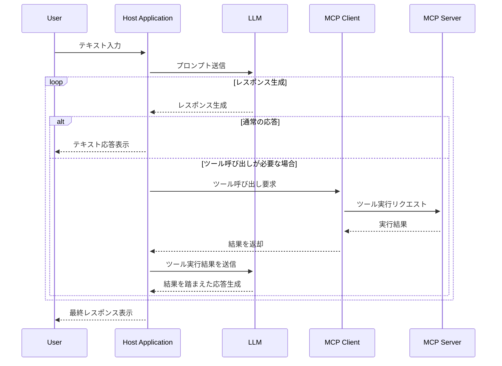

# この記事について
最近流行りに流行っているMCPですが、著者自身これを知った時に浅はかながら「なんかよさそう」と思っていました。浅い。

一般的にLLMはチャットアプリケーションに活用されてきたように思いますが、MCPによってLLMに手足を簡単に生やすことができるようになりました。
これまでもMCPにおけるToolにあたるような機能を実現するFunctional Calling等がありましたが、MCPという形でプロトコル化されたことにより、決まった形でやり取りすることができるようになったようです。
https://qiita.com/7shi/items/e27866ce51c6b9a0f605

MCPに関する詳しい記事は世の中に転がりまくっているので説明は割愛します。

今回は、そんなMCPの中身がどうなっているのか知りたいぞーと思い立った筆者が**SDKを自作してみてわかったこと**について書いていきます。
というのも、公式ドキュメントを読んでも、記事を読んでも概念的にしか概要を掴めなかったので、コードベースで理解したい気持ちがありました。そこで、公式から出ている、[typescript-sdk](https://github.com/modelcontextprotocol/typescript-sdk)をGolangにリプレースする形で理解していこうという個人的プロジェクトを立ててみました。コードリーディングするだけでよかっただろとも思いますが笑。若気の至りですね（？）。
https://github.com/modelcontextprotocol/typescript-sdk

▼ 今回著者が実装したもの（ロゴをつけたらそれっぽくなりました）
https://github.com/kakkky/mcp-sdk-go

::::message
パッケージのロゴとして作成してもらいましたが、AIは完璧にGopherを認識していたようです。

::::

typescript-sdkのリポジトリを選んだ理由は、「一番使われてそう」という印象からです。
::::message
GitHubスター数でいうと、pythonのsdkが最も高そうです。
(執筆時点)
- typescript-sdk : ⭐️8.1k
- python-sdk : ⭐️15.3k

後から知りました（まあ自分はpython知らないので...）。
::::

巷では、もうそろ公式からもGo製のSDKが出る？という話もあります。それに、サードパーティ製ではありますが、Goでは以下がデファクトになりつつあるようです。
https://github.com/mark3labs/mcp-go

すでにこれがあるのになんで開発した....？というツッコミをされそうですが個人的にそれはあまり関係なく、「学習用途」の側面が大きいです。

::::message
[mcp-go](https://github.com/mark3labs/mcp-go)は見ない！という（謎の）縛りを課していたので、自分が実装したものと似ているのかそうでないのかはいまだに知りません...笑

使用例を見た感じ、ぜんぜん違いそうですね。
:::::


特徴を挙げるなら、公式のtypescript-sdkライクにGoでも書けるというところでしょうか。

ちなみに、自作したSDKはちゃんと動きます（じゃなきゃ困る）
公式から出ているmcp-inspectorでもしっかり動くことを確認しています。
https://github.com/modelcontextprotocol/inspector

Claude-Desktopでも動きました。
自身のリポジトリにおいてあるこのexampleのプログラムを`go build`したものを設定ファイルにおいてみています。
https://github.com/kakkky/mcp-sdk-go/blob/main/examples/server/with-stdio/main.go
▼ Toolを呼び出す

▼ サーバーに登録しているprompt,resourceをClaudeに参照させることができる


MCPクライアントの方も動きます。
以下のexampleを実行してみると、
https://github.com/kakkky/mcp-sdk-go/blob/main/examples/client/cli-use/main.go
しっかりjsonrpcでやり取りしていることがわかります。
```
2025/06/29 10:41:27  Client :  {"jsonrpc":"2.0","id":1,"method":"initialize","params":{"protocolVersion":"2025-03-26","capabilities":{"roots":{"listChanged":true}},"clientInfo":{"name":"example-client","version":"1.0.0"}}}
2025/06/29 10:41:27  Server :   {"jsonrpc":"2.0","id":1,"result":{"protocolVersion":"2025-03-26","capabilities":{"completion":{},"prompts":{"listChanged":true},"resources":{"listChanged":true},"tools":{"listChanged":true}},"serverInfo":{"name":"example-server","version":"1.0.0"}}}

2025/06/29 10:41:27  Client :  {"jsonrpc":"2.0","method":"notifications/initialized"}

Initialization complete 🎉 Client is ready to send commands.

2025/06/29 10:41:27  Client :  {"jsonrpc":"2.0","id":2,"method":"tools/list"}
2025/06/29 10:41:27  Server :   {"jsonrpc":"2.0","id":2,"result":{"tools":[{"name":"calculate","description":"This tool calculates the sum of two numbers","inputSchema":{"type":"object","properties":{"first":{"type":"number","description":"This is the first parameter"},"second":{"type":"array","description":"This is the second parameter, which is an array of numbers"}}}}]}}

2025/06/29 10:41:27  Client :  {"jsonrpc":"2.0","id":3,"method":"tools/call","params":{"name":"calculate","arguments":{"first":5,"second":[10,20]}}}
2025/06/29 10:41:27  Server :   {"jsonrpc":"2.0","id":3,"result":{"content":[{"type":"text","text":"The result of the addition is: 35"}]}}

Enter method :  ping
2025/06/29 10:41:30  Client :  {"jsonrpc":"2.0","id":4,"method":"ping"}
2025/06/29 10:41:30  Server :   {"jsonrpc":"2.0","id":4,"result":{}}

Ping &{}
```
自作SDKの話はこれくらいにしておきましょう。

実装を通して、MCPに関してわかったことを次に書き連ねていきます。

# わかったこと
説明には図解に加え、自作SDKから引用したコードベースを用いていきます。
## MCPのアーキテクチャ
MCPには大きく分けて、以下の二層構造となっています。
- プロトコル層
- トランスポート層

プロトコル層がその名の通り、MCPの挙動の（ほぼ）全てを決めています（詳しくは後述）。
トランスポート層は、サーバーとクライアントの通信を実現するものです。その通信方法は多岐に渡りますが、今の所一般的なのは以下の３つです。
- Stdio
- Streamable HTTP
- (Server Sent Events)

https://modelcontextprotocol.io/specification/2025-06-18/basic/transports

MCPにおいて、トランスポートは厳密に規定があるわけではないと思います。
>The protocol currently defines two standard transport mechanisms for client-server communication:
>1. stdio, communication over standard in and standard out
>2. Streamable HTTP

一応２つのトランスポートが定義されていますが、カスタムトランスポートを実装しても良いということが以下のように書かれています。
>It is also possible for clients and servers to implement custom transports in a pluggable fashion.

**MCPに責任があるのは、プロトコル層の部分**です。トランスポート層に関しては、クライアント/サーバーでともに対応していれば通信が可能です。

プロトコル層はトランスポートのインターフェースに依存しており、トランスポートの具体型（Stdio/SSE/Streamable HTTP）をプラガブルに変えることが可能です。
「技術的詳細であるトランスポート層」と「上位の方針であるプロトコル層」が疎結合に構成されている、キレイかつシンプルなアーキテクチャになっています。


これは公式ドキュメントにも書いています。
https://modelcontextprotocol.io/docs/concepts/architecture

サーバー/クライアントの両方がこの二層で構成されており、以下のように通信を実現しています。


二層について少し深ぼっていきます。
### プロトコル層
公式ドキュメントでは以下のように説明されています。
>The protocol layer handles message framing, request/response linking, and high-level communication patterns.

この層が定義しているのは、以下の３つのようです。
- メッセージのフレーミング
- リクエスト・レスポンスのリンク
- 高レベルの通信パターン

この説明だけではよくわかりません。今回実装してみて、自分なりに解釈したプロトコル層の役割は以下３点です
1. やり取りするメッセージ形式を決める
2. 概念的な通信を表現する
3. リクエストに対するレスポンスの紐付けをする

#### 1. やり取りするメッセージ形式を決める
クライアント/サーバーでやり取りするためのメッセージプロトコルを決めます。
Web APIから考えてみます。そこではJSONでやり取りするかもしれませんし、XMLでやり取りするかもしれません。

MCPでも同じようにプロトコルとして規定されており、それが**JSON-RPC 2.0**です。
https://www.jsonrpc.org/specification

名前の通りJSONベースでRPCを実現するものです。
Request/Response/Notification/Error の４つの形が決まっています。
| 種類           | 必須フィールド                             | 説明                                                                 |
|----------------|-------------------------------------------|----------------------------------------------------------------------|
| **Request**     | `jsonrpc`, `method`, `id`                 | クライアントからサーバーへメソッド呼び出しを要求するメッセージ。                                 |
| **Response**    | `jsonrpc`, `id`, `result` または `error` | サーバーが Request に対して返す応答。成功時は `result`、失敗時は `error` を含む。              |
| **Notification**| `jsonrpc`, `method`                       | 応答を必要としない呼び出し（`id` を含まない）。サーバーは応答しない。                            |
| **Error**       | `jsonrpc`, `id`, `error`                  | エラー応答。`error` オブジェクトには `code`, `message`, （任意で `data`）が含まれる。            |

以下は通信のログを抜粋して整形したものです。
```json
// Clientからリクエスト送信
{
  "jsonrpc": "2.0",
  "id": 1,
  "method": "initialize",
  "params": {
    "protocolVersion": "2025-03-26",
    "capabilities": {
      "roots": {
        "listChanged": true
      }
    },
    "clientInfo": {
      "name": "example-client",
      "version": "1.0.0"
    }
  }
}

// Serverがそれに対してレスポンスを送信
{
  "jsonrpc": "2.0",
  "id": 1,
  "result": {
    "protocolVersion": "2025-03-26",
    "capabilities": {
      "completion": {},
      "prompts": {
        "listChanged": true
      },
      "resources": {
        "listChanged": true
      },
      "tools": {
        "listChanged": true
      }
    },
    "serverInfo": {
      "name": "example-server",
      "version": "1.0.0"
    }
  }
}

// レスポンスを受け取ったClientが通知を送信
{
  "jsonrpc": "2.0",
  "method": "notifications/initialized"
}
```

しっかり則っていることがわかります。

#### 2. 概念的な通信を表現する
「概念的な」と表しているのは、実際の通信を行うのはトランスポート層の役目であることを強調するためです。
**Transportはあくまで送信・受信を実現するもの**です。
送信するものが「リクエスト」なのか、「通知」なのか。また、受信するものが「レスポンス」なのか「リクエスト」、もしくは「通知」なのか...それを決める責務はProtocolが持っているようです。

Serverモジュール、Clientモジュールは共通のProtocolモジュールを利用しています。Serverモジュール、ClientモジュールはTransportを全く意識しません。
基本的にServerモジュール、ClientモジュールはProtocolモジュールを操作するのです。
Protocolモジュールは以下のメソッドを提供します。
```go
// 一部抜粋
type Protocol interface {
    // リクエストハンドラの登録
    SetRequestHandler(schema schema.Request, handler func(schema.JsonRpcRequest) (schema.Result, error))
    // 通知ハンドラの登録
    SetNotificationHandler(schema schema.Notification, handler func(schema.JsonRpcNotification) error)
    // リクエストの送信
    Request(request schema.Request, resultSchema any) (schema.Result, error)
    // 通知の送信
    Notificate(notification schema.Notification) error
}
```
例えば、サーバーからPingリクエストを送る`Ping`メソッドは以下のように定義されています。
```go
func (s *Server) Ping() (schema.Result, error) {
    // Protocolで定義されているRequestメソッドを利用している
	return s.Request(&schema.PingRequestSchema{
		MethodName: "ping",
	}, &schema.EmptyResultSchema{})
}
```

つまり、プロトコル層は、リクエスト送信などの通信を概念的に表現していることになります。
実際にそれを送信するのはTransportの役目ですが、Protocolの中に隠蔽されています。
ServerやClientはProtocolから提供される通信メソッドをただ呼び出すだけでいいのです。

図で表すと以下のように表現できます。


#### 3. リクエストに対するレスポンスの紐付けをする
リクエストを送信した場合は、そのレスポンスを期待します。
::::details コード
```go
func (p *Protocol) Request(request schema.Request, resultSchema any) (schema.Result, error) {
    // 一部省略
	p.requestMessageId += 1
	messageId := p.requestMessageId
	jsonRpcRequest := schema.JsonRpcRequest{
		BaseMessage: schema.BaseMessage{
			Jsonrpc: schema.JSON_RPC_VERSION,
			Id:      messageId,
		},
		Request: request,
	}
	// リクエストに紐づくレスポンスハンドラを登録する
	p.SetResponseHandler(messageId, func(response *schema.JsonRpcResponse, mcpErr error) (schema.Result, error) {
		// レスポンスの型をチェック
		result := response.Result
		resultT := reflect.TypeOf(result)
		schemaT := reflect.TypeOf(resultSchema)
		if resultT != schemaT {
			return nil, fmt.Errorf("result type mismatch: expected %s, got %s", schemaT, resultT)
		}
		return result, nil
	})
	// リクエストの送信
	if err := p.transport.SendMessage(jsonRpcRequest); err != nil {
		return nil, err
	}
	// 登録したレスポンスハンドラーからの結果を待つ
	select {
	case result := <-p.respCh:
		return result, nil
	case err := <-p.errRespCh:
		return nil, err
	}
}
```
::::
具体的に以下の流れとなっています。

1. リクエスト送信時に一意のメッセージIDを発行
```go
p.requestMessageId += 1
messageId := p.requestMessageId
```
2. 発行したメッセージIDをリクエストに含める
```go
jsonRpcRequest := schema.JsonRpcRequest{
    BaseMessage: schema.BaseMessage{
        Jsonrpc: schema.JSON_RPC_VERSION,
        Id:      messageId,
    },
    Request: request,
}
```
3. リクエストに対応するレスポンスハンドラを登録
```go
// 引数には1で発行したmessageIdを入れている
p.SetResponseHandler(messageId, func(response *schema.JsonRpcResponse, mcpErr error) (schema.Result, error) {
    // レスポンスの型をチェック
    result := response.Result
    resultT := reflect.TypeOf(result)
    schemaT := reflect.TypeOf(resultSchema)
    if resultT != schemaT {
        return nil, fmt.Errorf("result type mismatch: expected %s, got %s", schemaT, resultT)
    }
    return result, nil
})
```

これにより、以下のようにリクエスト-レスポンスの組み合わせが`id`によって識別できるようになります。(冒頭に提示したログから抜粋)
```
2025/06/29 10:41:27  Client :  {"jsonrpc":"2.0","id":2,"method":"tools/list"}
2025/06/29 10:41:27  Server :   {"jsonrpc":"2.0","id":2,"result":{"tools":[{"name":"calculate","description":"This tool calculates the sum of two numbers","inputSchema":{"type":"object","properties":{"first":{"type"
```
```
2025/06/29 10:41:30  Client :  {"jsonrpc":"2.0","id":4,"method":"ping"}
2025/06/29 10:41:30  Server :   {"jsonrpc":"2.0","id":4,"result":{}}
```

また、ここからステートフルなやり取りが行われていることがわかります。

### トランスポート層
トランスポート層は、先述した通り送信・受信を実現します。

受信に関してStdioを例にどうなっているか簡単に説明します。
以下の図にあるように、受信時の処理はProtocolに定義されていて、実際の受信（メッセージ取得）はTransportが行っています。


また、Transportの具体がいつ注入されているかというと、`Connect`メソッドになります。このメソッドは、名前の通りトランスポートに「接続」し、クライアントとの通信を始めます。通信を始めるというのは、具体的には「初期化フェーズ」と言われるものです。
https://modelcontextprotocol.io/specification/2025-06-18/basic/lifecycle#initialization

::::message
初期化フェーズは単純に、通信できる状態を互いに確認するための形式的なものです。
- Client「通信始めるよー。自分の提供する機能は....」
- Server「了解。自分の提供する機能は.....」
- Client「お、了解あざす。じゃあ通信を始めますよと通知を送っておこう」
- Server（通知きた。これからちゃんとやり取りが始まるんやな）
::::

```go
// 他省略
// サーバー用Stdioトランスポートを初期化
transport := transport.NewStdioServerTransport()
// mcpServerは*mcpserver.McpServer型のインスタンス
mcpServer.Connect(transport)
```
以下のように定義しています。
```go
func (p *Protocol) Connect(transport Transport) error {
    // トランスポートの具体を注入
	p.transport = transport
    // トランスポート側にProtocolで定義された処理を注入
	p.transport.SetOnClose(p.onClose) // クローズ時
	p.transport.SetOnError(p.onError) // エラー時
	p.transport.SetOnReceiveMessage(p.onReceiveMessage) // 受信時
	if err := p.transport.Start(); err != nil {
		return err
	}
	return nil
}
```
上で説明したようにTransportがメッセージ受信時にProtocolに定義された処理を実行できるのは`Connect()`内の以下の部分が関係しています。
```go
p.transport.SetOnReceiveMessage(p.onReceiveMessage) // 受信時
```

## 「Stdioトランスポートで通信を行う」とは
これを実装する以前、標準入出力を使ってサーバー/クライアントの通信を行うイメージが全く湧きませんでした。実際、そんなにややこしい話でもなかったです。

Stdioトランスポートでやり取りされるMCPサーバーは基本的に、ローカルで起動されるものです。
Google DriveのMCPサーバーの設定方法を見てみましょう。
https://github.com/modelcontextprotocol/servers-archived/tree/main/src/gdrive#npx
以下のように設定ファイルに書くように言われています。
```json
{
  "mcpServers": {
    "gdrive": {
      "command": "npx",
      "args": [
        "-y",
        "@modelcontextprotocol/server-gdrive"
      ],
      "env": {
        "GDRIVE_CREDENTIALS_PATH": "/path/to/.gdrive-server-credentials.json"
      }
    }
  }
}
```
https://github.com/modelcontextprotocol/servers-archived/tree/main/src/gdrive

`npx`コマンドは、npmパッケージをオンラインで取得してきてローカルでそのプログラムを実行するものです。つまり、MCPサーバーが立つのはローカルになります。
反対に、HTTPベースのトランスポートが使われている場合の設定ファイルは以下のようになります。
この場合、サーバーはリモートで起動することになります。
```json
{
  "mcpServers": {
    "github": {
      "url": "https://api.githubcopilot.com/mcp/"
    }
  }
}
```
https://github.com/github/github-mcp-server/tree/main


話を戻して、ローカルでサーバーが起動するStdioの場合は、どのようにServer/Client間で通信するかというと、まず以下のことを理解する必要があります。
- Clientが親プロセスであり、子プロセスとしてServerプログラムを実行する


どのように子プロセスとやり取りするかというと、Pipeを用いた親プロセス↔️子プロセス間の双方向通信によって成り立っています。

::::message
Pipeを使うかどうかは実装される言語によるかもしれません。
typescript-sdkでは、`child_process.spawn()`で作成されたプロセスの`stdin`,`stdout`プロパティを利用しています。
::::

以下のコードでは、子プロセスの標準入出力を親プロセスにPipeで渡していることを表します。
```go
type StdioClientTransport struct {
	// 他省略
	stdinPipe    io.WriteCloser // 標準入力のパイプ（サーバープロセスにメッセージを送信するため）
	stdoutPipe   io.ReadCloser  // 標準出力のパイプ（サーバープロセスからのメッセージを受信するため）
}


func (s *StdioClientTransport) Start() error {
    // 子プロセス（サーバープログラム）起動
	s.process = exec.Command(s.serverParams.Command, s.serverParams.Args...)
	if len(s.serverParams.Env) > 0 {
		s.process.Env = s.serverParams.Env
	} else {
		s.process.Env = getDefaultEnvironment()
	}
	stdinPipe, err := s.process.StdinPipe()
	if err != nil {
		return err
	}
	s.stdinPipe = stdinPipe // 標準入力のパイプ
	stdoutPipe, err := s.process.StdoutPipe()
	if err != nil {
		return err
	}
	s.stdoutPipe = stdoutPipe // 標準出力のパイプ

    // 省略
}
```
Clientからリクエストを送信する際は、以下のように子プロセスの標準入力に書き込みます。
```go
func (s *StdioClientTransport) SendMessage(message schema.JsonRpcMessage) error {
	data, err := jsonrpc.Marshal(message)
	if err != nil {
		return fmt.Errorf("failed to marshal message: %w", err)
	}
	// 改行を追加して標準入力に書き込む
	log.Println(" Client : ", string(data))
    // 子プロセスの標準入力に書き込む（これによりサーバーが標準入力からメッセージを受け取る）
	_, err = s.stdinPipe.Write(append(data, '\n'))
	if err != nil {
		return fmt.Errorf("client failed to write message to stdin: %w", err)
	}
	return nil
}
```
また、Serverから送信されるメッセージは、Clientによって以下のようにパイプされた出力を監視しています。Serverが標準出力に書き込んだ時、それはパイプされて親プロセスの`s.stdoutPipe`に渡るということです。
```go
// 標準出力からデータを\nごとに受け取り、onDataコールバックを呼び出す
func (s *StdioClientTransport) stdinOnData() {
	scanner := bufio.NewScanner(s.stdoutPipe)
	// 標準出力のスキャナーを使用して、データを読み取る
	for scanner.Scan() {
		data := scanner.Text()
		// Scannerは改行を含まないので、改行を追加して
		if err := s.onData([]byte(data + "\n")); err != nil {
			s.OnError(fmt.Errorf("failed to read data from stdout: %w", err))
			return
		}
	}
}
```
図で表すと以下のようになります。


(色は割と適当につけたんですが、こう見るとジ○イアン感がありますね....)

ちなみに、今回トランスポートとしてStdioしか実装していないので、他のHTTPベースのトランスポートだとどんな感じになっているのかも気になります。

## サーバー:クライアント＝1:1
これは述べるまでもない....?かもしれませんが、クライアントとサーバーは1対1で存在します。

引用元：https://zenn.dev/cloud_ace/articles/model-context-protocol

上の図を見てもわかるように、各MCPサーバーに１つずつクライアントが存在します。
これは設計上そうなっています。

以下はクライアントにおけるトランスポートの初期化をしている部分ですが、１つのサーバープログラムしか受け付けていません。
```go
stdioClientTransport := transport.NewStdioClientTransport(
		transport.StdioServerParameters{
			Command: "go",
			Args:    []string{"run", "./examples/server/with-stdio/main.go"}, // サーバープログラムの実行コマンド
		},
	)
```

公式ドキュメントでは以下のようにあります。
>A host application creates and manages multiple clients, with each client having a 1:1 relationship with a particular server.
>訳：ホスト アプリケーションは複数のクライアントを作成および管理し、各クライアントは特定のサーバーと 1:1 の関係を持ちます。

以下の記事でもわかりやすく述べられています。
https://zenn.dev/nasubikun/articles/1bce68db0763fd

このような構造になっている理由は、以下の理由がありそうです（AIに聞いてみた）。
- シンプルさの維持
    - 1:1だとシンプルで
- セッションの独立性
    - 各クライアント接続は独自のセッション状態を持ち、互いに干渉しない
- セキュリティ境界
    - 複数のクライアントが同じ接続を共有すると、権限分離が難しくなる

ほー、なるほどって感じですね。的外れなことを言っているわけではなさそうです。

## MCPは結局何を実現しているのか
合間合間に作業して1ヶ月半ほどかけて実装してきた`mcp-sdk-go`ですが、

「結局MCPって何を実現してるん？」

という、当初抱えていた一番重要な疑問に対し、今回の開発を終えて自分なりに出せる回答は、

- **Client/Serverの構成にしたことによって、外部コンテキストやツール呼び出しを提供する部分をServer側に切り出すことができるようになった**
- **そして、Client/Serverのやり取りがプロトコルによって規定されたことにより、開発者はそれに則ったServer（MCPサーバー）さえ作ればいいようになった**

といった感じかなぁと思います。

全体的なデータフローは以下のように表せると思います（間違ってたら教えてください）。


「LLMに外部コンテキストを参照させたい」、「LLMチャットアプリケーション（Host Application）を通したAPI呼び出し等を行ないたい」場合、**開発者が実装すべきはシーケンス図の一番右の「MCP Server」のみ**です。
もちろん、そのHost ApplicationにMCP Clientが搭載されている必要がありますが、世に出ているLLMチャットアプリケーションの多くはMCPに対応しています。

そして、数あるMCPのSDKは、

- **「JSON-RPC 2.0」という規定のメッセージ形式と各プログラミング言語の構造化されたコードを相互に変換することにより、開発者が扱いやすいようにしている**

と言えそうだなと思います。
JSON-RPCもただの文字列なので、それを生の状態で扱うのは開発しづらいです。これを各プログラミングのコードにコンバージョンすることによって、開発しやすくなります。Goだったら構造体とかですね。

# 感想
ノリで始めたtypescript-sdk➡️golangへのリプレースですが、mcpのメカニズムに関しての解像度も上がったのでよかったです。
また、それとは別になかなか苦しかったのは、typescriptと比較した時のGolangの型表現の貧相さですかね。
typescript-sdkのコードと公式ドキュメントを行き来して睨めっこしつつ、それをGolangに落とし込む作業でしたが、静的型付けではあるものの言語の仕様も全然違うので「そのまま書き換える」のは簡単ではありませんでしたね。

SDKを自作するにあたり、数々の方の記事を参考にさせていただきました。
https://zenn.dev/loglass/articles/320812a6629a45
https://zenn.dev/codeciao/articles/cline-mcp-server-overview
https://zenn.dev/nasubikun/articles/1bce68db0763fd
https://zenn.dev/razokulover/articles/9a0aee8ceb9f3f
https://zenn.dev/su8/articles/edc7ac5a8e0046
https://zenn.dev/kazuwombat/articles/d8789724f10092
https://zenn.dev/cloud_ace/articles/model-context-protocol

