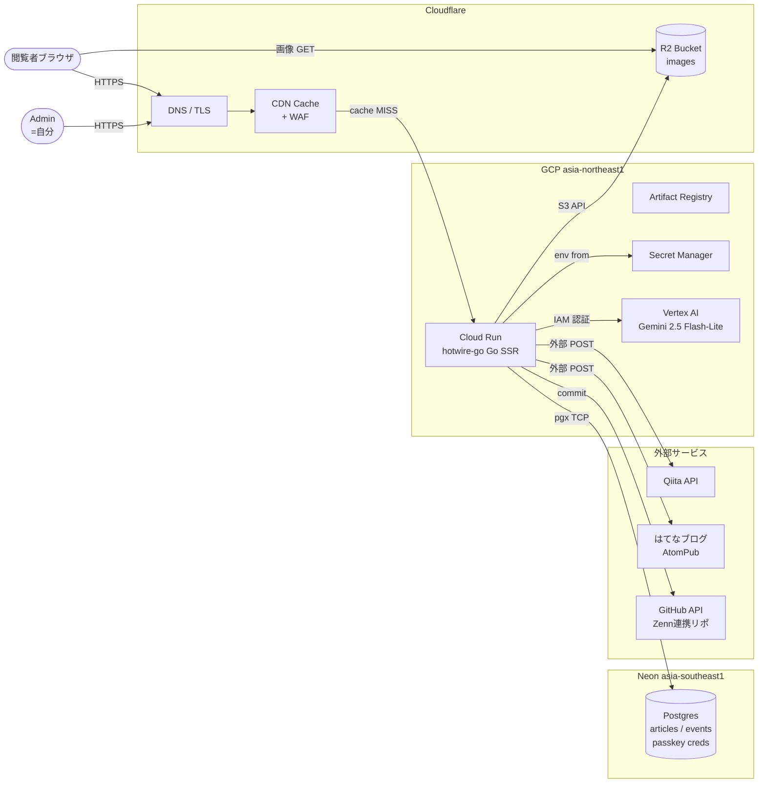
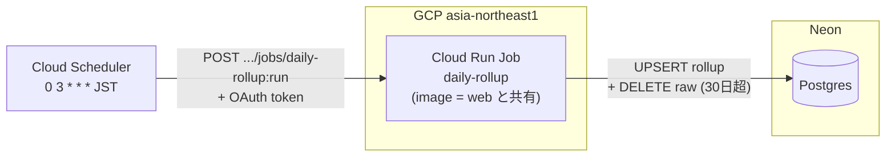
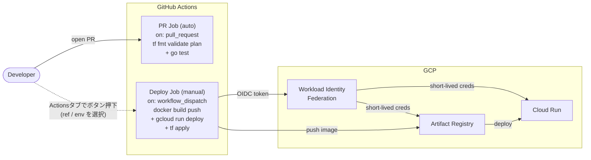
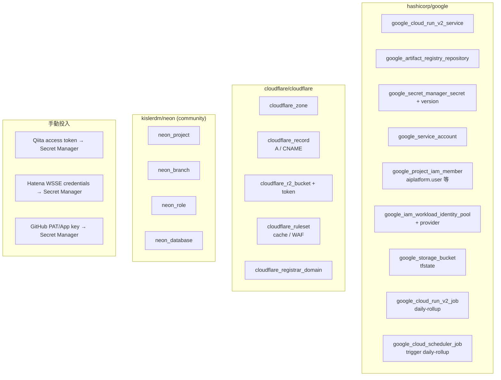

# 個人ブログ — インフラ構成プラン

本ドキュメントは **インフラ層のみ** を対象とする。アプリケーション設計 (ドメインモデル / ハンドラ / テンプレート / クロスポスト変換ロジック等) は別途。

## Context

セルフブランディング兼個人開発として、個人ブログサイトを新規構築する。インフラ選定の背景となる要件のみ列挙する。

- 主に SSR、`github.com/kakkky/hotwire-go` (Turbo + Go テンプレート + Stimulus) を使用 → **Go を動かせる compute 基盤**が必要
- admin (自分) 画面から記事投稿・エンゲージメント統計・AI 要約を扱う → **DB、AI API、admin 用の安全な認証経路**が必要
- 記事に画像を添付できる → **object storage** が必要
- Zenn / Qiita / はてなブログにクロスポスト → **外部 API 呼び出し可能な環境と secret 管理**
- **完全無料運用**を狙う
- **インフラは Terraform で全管理**
- Turbo Streams SSE / real-time は使わない → **Redis / Pub-Sub 系 broker は不要**

## 決定した技術スタック

| 層 | サービス | 理由 |
|---|---|---|
| Compute (origin) | **Cloud Run** (GCP, asia-northeast1) | Go SSR を無改造で載せられる。always-free 枠 (月 2M req / 360k GiB-sec / 180k vCPU-sec) が広く個人ブログなら実質 0 円 |
| Edge / CDN / DNS / WAF | **Cloudflare** | 無料枠が最大級。origin (Cloud Run) 前段にキャッシュ層を置き公開ページを cache HIT で捌く |
| Object Storage | **Cloudflare R2** | 10GB 無料、**egress 完全無料**、S3 互換 API (`aws-sdk-go-v2` そのまま) |
| Database | **Neon** (Postgres) | 無料 0.5GB、公式 Terraform provider が最も成熟。Cloud Run から TCP で pgx 接続可能 |
| Auth (admin) | **Passkey (WebAuthn)** | 単一ユーザ想定でパスワードレス。credential public key を DB に保存、外部サービス依存無し |
| AI 要約 | **Vertex AI Gemini 2.5 Flash-Lite** | **IAM 認証で API key 不要**。Cloud Run の SA に `roles/aiplatform.user` を付与するだけ。料金は個人ブログ規模で年 1 円レベル |
| Domain | **Cloudflare Registrar** で新規取得 | 卸売価格 (マージン無し)。DNS も同 Zone で管理 |
| CI/CD | **GitHub Actions + Workload Identity Federation (WIF)** | PR で自動テスト、**deploy は `workflow_dispatch` で手動発火** (Actions タブのボタン)。短命 credential で GCP へ deploy し long-lived key を GitHub Secret に置かない |
| 定期バッチ | **Cloud Run Jobs + Cloud Scheduler** | analytics 日次 rollup + raw event 削除。Cloud Run Jobs は Cloud Run always-free 枠を共有 (無料)、Cloud Scheduler も 3 job まで無料。web service とは image は共通、entrypoint を分けて責務分離 |
| Terraform state | **GCS bucket + object versioning** | bootstrap のみ手動、以降は Terraform 管理 |

### 不採用にした選択肢と理由 (短く)

- **Fly.io** — 2024/10 に free tier 廃止
- **Render (free web service)** — 15 分で sleep + cold start 数十秒級
- **Cloudflare Workers + `syumai/workers` (Go WASM)** — 無料枠 script size 3MB 上限に hotwire-go が収まらない可能性大。DB も HTTP driver 必須で構成が非直感的
- **Cloudflare Containers** — 無料枠が狭く少額課金が発生しやすい
- **Turso** — SQLite 互換で魅力だが、Terraform provider がコミュニティ製で成熟度が Neon に劣る
- **OpenAI / Google AI Studio** — Vertex AI と違い API key が必要で secret 管理コストが増える (Vertex AI は IAM で完結)

## アーキテクチャ図

### システム全体



### 定期バッチ (Cloud Run Jobs)

日次 rollup + raw event 削除は **Cloud Run Jobs で別プロセス**として実行。web service とは image は共有 (entrypoint 切り替え) で CI 簡素、責務は分離。



- Cloud Run Jobs: **Cloud Run と同じ always-free 枠を共有** (無料)
- Cloud Scheduler: 3 job まで無料 (使うのは 1 job)
- retry / timeout は Job resource 側で宣言 (`max_retries = 3`, `timeout = 300s`)
- 追加バッチ (crosspost 一括再送、記事一括 re-summarize 等) が必要になれば `cmd/xxx/main.go` を足すだけで同じパターンで拡張可能

### CI/CD フロー

deploy は自動ではなく **GitHub Actions タブから手動発火 (`workflow_dispatch`)**。
PR merge をトリガーにしない (本番反映のタイミングを自分でコントロール)。



### Terraform 管理範囲



## リポジトリ構成 (infra 部分のみ)

```
personal-blog/
├── infra/terraform/
│   ├── envs/
│   │   ├── dev/
│   │   │   ├── main.tf         # provider / backend / module 呼び出し
│   │   │   ├── variables.tf
│   │   │   └── terraform.tfvars
│   │   └── prod/
│   ├── modules/
│   │   ├── cloudrun/           # Cloud Run Service + SA + IAM
│   │   ├── cloudrun_job/       # Cloud Run Job (daily-rollup) + SA
│   │   ├── scheduler/          # Cloud Scheduler → Cloud Run Job trigger
│   │   ├── artifact_registry/
│   │   ├── secret_manager/     # secret 定義のみ (値は手動 or CI)
│   │   ├── wif/                # Workload Identity Federation
│   │   ├── vertex_ai_access/   # SA に aiplatform.user 付与
│   │   ├── cloudflare_zone/    # DNS + WAF + cache rule
│   │   ├── cloudflare_r2/      # bucket + API token
│   │   └── neon/               # project + branch + role + db
│   └── bootstrap/              # tfstate 用 GCS bucket (手動 apply 1 回)
├── .github/workflows/
│   ├── ci.yml                  # on: pull_request → tf plan + go test
│   └── deploy.yml              # on: workflow_dispatch → build push deploy + tf apply
└── Dockerfile                  # multi-stage build: 1 image に server / rollup を同梱、Service と Job で args (entrypoint) を切替
```

## Secret Manager に入れるもの

- Qiita access token
- はてなブログ WSSE credentials (username + api key)
- GitHub PAT または App private key (Zenn 連携リポへの commit 用)
- Neon connection string (Terraform output → SM に登録 → Cloud Run 環境変数として mount)
- WebAuthn RP secret (必要なら)
- R2 access key (Terraform 生成 → SM 登録 → Cloud Run 環境変数)
- **Vertex AI 用 API key は不要** (IAM 経由)

## ネットワーク / パフォーマンス上の考慮

- **Neon Tokyo region が無い**問題: 現状 asia-southeast1 (Singapore) が最寄り。Cloud Run (Tokyo) からは ~70-100ms のクロスリージョン RTT
  - 対策: 公開ページは Cloudflare edge cache で吸収 (`cache-control: s-maxage=...`)。admin は個人利用なので許容。将来 Tokyo 対応時に移行
- **Cloud Run cold start**: `min-instances=0` (無料枠維持) で初回 ~1s。公開ページはキャッシュに載れば無影響
- **Cloudflare purge 戦略**: 記事更新時は該当 URL だけ pinpoint purge (`cache_tags` 併用)

## 未確定 / 後追いで良い点

- Neon リージョン最終決定 (Singapore で立ち上げ、性能を見て判断)
- Cloudflare cache tag の設計粒度
- WebAuthn の RP ID (ドメイン取得後に確定)
- 分析 raw event の保持期間: **30 日で確定** (Cloud Run Job daily-rollup で `DELETE FROM page_visits WHERE visited_at < now() - interval '30 days'` を実行、rollup テーブルに永続集計)

## 検証手順 (インフラ層)

1. `bootstrap/` を手動 apply → tfstate 用 GCS bucket が出来る
2. `envs/dev/` の `terraform apply` で google / cloudflare / neon 全 provider が通る
3. Cloud Run にダミー Go サーバをデプロイ → 独自ドメインで HTTP 200 が返る
4. 2 回目リクエストで `cf-cache-status: HIT` になる
5. Cloud Run から Neon への `SELECT 1` が pgx で成功する
6. R2 に aws-sdk-go-v2 で PutObject → 公開 URL で GET できる
7. Cloud Run の SA から Vertex AI Gemini 呼び出しが **環境変数の API key 無しで** 成功する
8. Actions タブから `deploy.yml` を手動発火 → WIF 経由で Cloud Run revision が更新される (long-lived key を一切使わずに)
9. Cloud Scheduler が Cloud Run Job (`daily-rollup`) を叩き、Job execution が成功する (rollup テーブル更新 + 期限切れ raw event 削除を Neon 側で確認)
10. `terraform destroy` → `terraform apply` を再実行しても冪等に元の構成へ戻る
